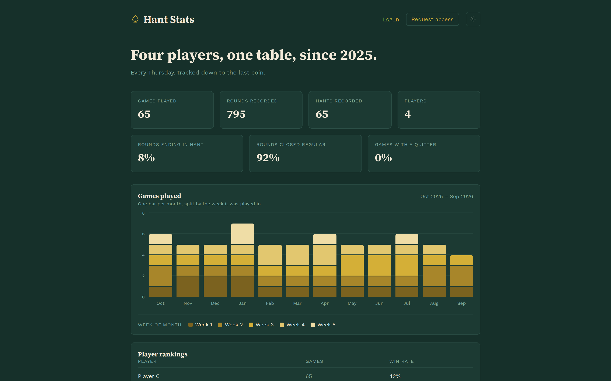
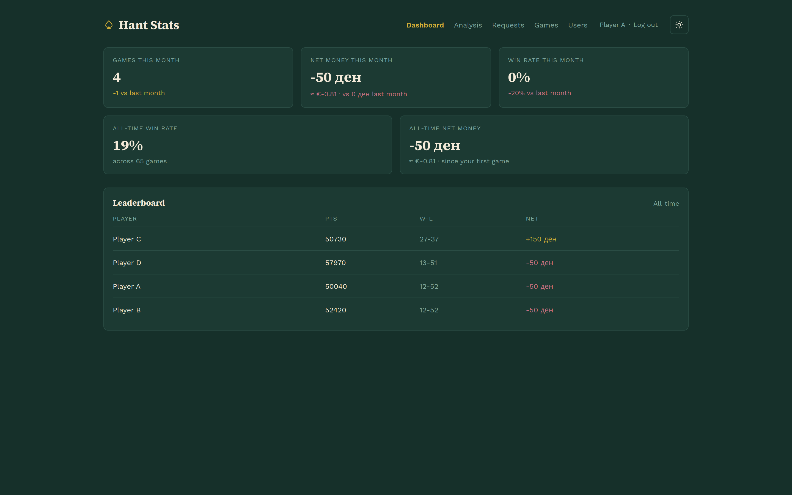
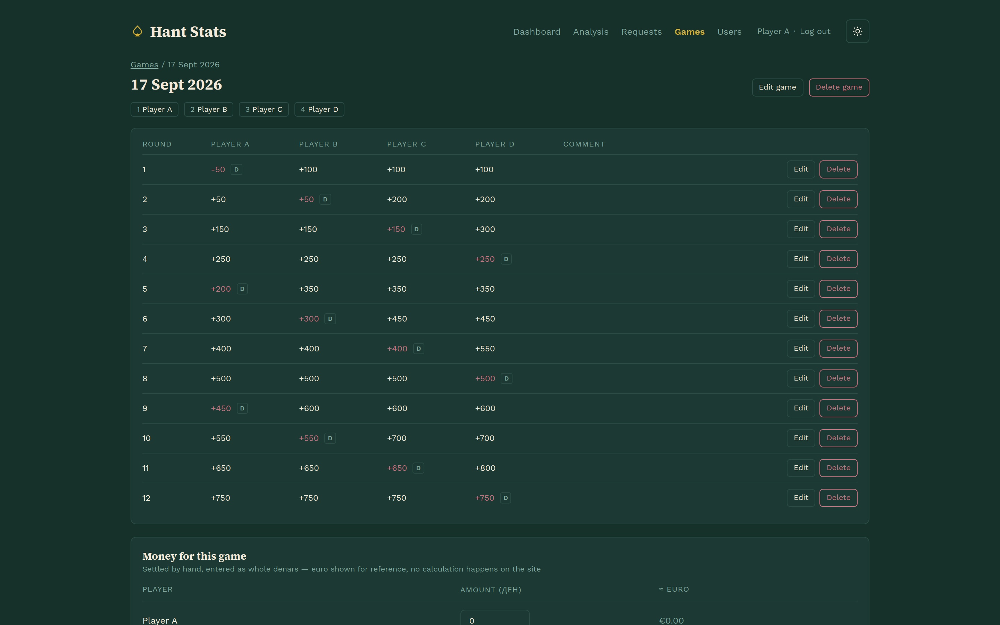
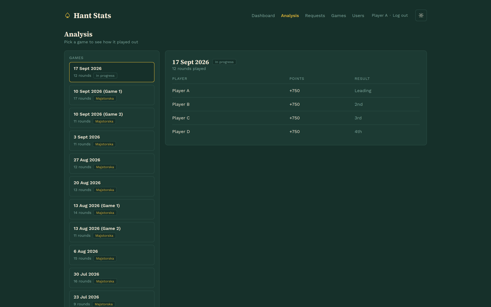
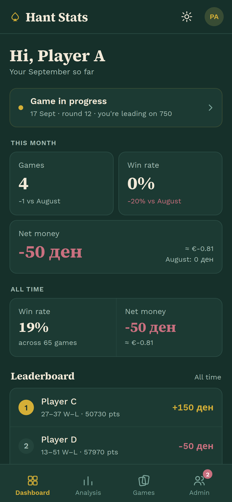
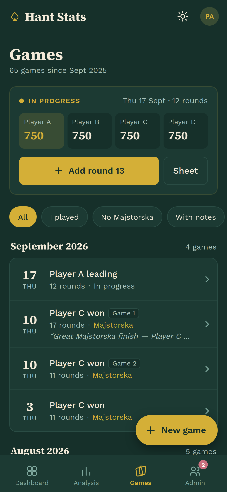

# Hant Tracker

We play cards. Every week, around a table, with a pen and a paper sheet —
because that is the fun part and no app is going to improve on it. What the
paper is bad at is remembering. A sheet tells you who won *that* night; it
tells you nothing about who wins most often, who keeps ending up in the
Majstorska, or who still owes whom from three months ago.

Hant Tracker is where those sheets go afterwards. One player types the finished
game in, and the group gets a central record of every game we have ever played,
with the statistics falling out of it for free: standings, form over time,
head-to-head numbers, and the running tally of money between players.

So: the games stay on paper. The history stops being lost.

**What it does**

- **Games and rounds.** A game is 16 regular rounds plus the Majstorska, each
  round entered per player. Points come from the game's own rules — the winner
  takes a negative score, an opened hand counts the cards left in it, a Hant
  doubles what the losers pay.
- **Statistics.** A personal dashboard, an all-time leaderboard, and an
  analysis screen that replays any past game round by round. Non-players get
  a public page with the headline numbers.
- **Money.** Each game carries what was won and lost, so the debts between
  players are settled from the record instead of from memory.
- **Accounts.** Players sign up, an admin approves them; only admins can enter
  or change a game's results.

It runs on a phone at the table and on a laptop afterwards — the mobile screens
are their own layouts, not a squeezed desktop.

**Built with** Angular (TypeScript) and Spring Boot (Java 21, JPA, PostgreSQL
in production, in-memory H2 with seed data in development).

## Screenshots

The public page — what anyone gets without an account.



A player's dashboard: this month, all time, and where everyone stands.



A game, round by round, as it was copied off the paper sheet — with the money
for the night underneath.



The analysis screen replays any past game and how it finished.



On a phone, at the table — its own layout, not a shrunk desktop.

<p>
  
  
</p>

Screenshots come from the dev profile's seed data, so the players and numbers
are made up.

## Structure

- `design/` — design canvas artboards (`.dc.html`), reference mockups, and
  `link.txt` with the canvas URLs
- `frontend/` — Angular app
- `api/` — Spring Boot API (Java 21, Gradle, JPA/Hibernate, H2 in dev, PostgreSQL in prod)

## Running both

```
cd api && ./gradlew bootRun     # http://localhost:8080
cd frontend && npm start        # http://localhost:4200
```

`npm start` proxies `/api` to `http://localhost:8080` (`frontend/proxy.conf.json`),
so the browser only ever talks to its own origin.

In dev the API seeds an in-memory database with four regulars, a year of weekly
games and two pending sign-ups. Log in with any seeded email — `playera@example.com`
(admin), `playerb@example.com`, `playerc@example.com` — and the password
`password` (`app.seed.password`). `playerd@example.com` is seeded LOCKED on
purpose, so it is the one to test a rejected login with.

The dev database lives in memory: every restart drops it and seeds again, so
anything entered through the UI is gone with it.

## Frontend

```
cd frontend
npm install
npm start          # http://localhost:4200
```

The Angular CLI is a local dev dependency — use the npm scripts (`npm start`,
`npm run build`, `npm test`) or `npx ng ...`; there is no global `ng`.

Screens follow the artboards in `design/`. `HantDataService` is a thin
`HttpClient` layer over the API; `AuthService` holds the JWT the API issues and
keeps it in `localStorage`, and `authInterceptor` attaches it to every `/api`
call and drops the session on a 401/403.

Layout:

- `core/` — models, scoring rules, data + auth services, HTTP interceptor, route guards
- `shared/` — brand mark, theme toggle, formatting pipes
- `layout/` — signed-in shell (top nav, theme toggle)
- `features/` — public landing, auth, dashboard, analysis, admin screens
- `features/mobile/` — phone layouts of the signed-in pages (`design/mobile`)

Phones (under 768px wide) get an app layout with a bottom tab bar instead of
the desktop pages. `ViewportService` tracks the width, and each routed page
renders its `features/mobile` counterpart when it is narrow; URLs are the same
for both. Pages with a lot of state keep it in a page-scoped store
(`GamesStore`, `GameDetailStore`, `UsersStore`) that both layouts share.
Mobile-only styles live in `styles/_mobile.scss`, all prefixed `m-`.

Round points are computed in `core/scoring.ts` and sent to the API, which stores
them as given — the client owns the scoring rules.

## API

```
cd api
./gradlew bootRun                                  # dev profile: H2 + seed data
./gradlew bootRun --args='--spring.profiles.active=prod'   # PostgreSQL
```

The active profile also comes from `SPRING_PROFILES_ACTIVE`, and it is `dev`
when nothing sets it. The prod profile reads `DB_URL`, `DB_USER`, `DB_PASSWORD`,
and — set these before exposing it anywhere — `JWT_SECRET` and `CORS_ORIGINS`.
It runs no seeder; the first admin comes from `ADMIN_EMAIL` / `ADMIN_PASSWORD`,
which are used once on an empty database and can be removed afterwards.

A player an admin adds by hand gets `app.default-password` (`DEFAULT_PASSWORD`,
`changeme` by default) until they are given a real one.

Auth is a stateless JWT: `POST /api/auth/login` returns a token plus the user,
and the token goes back as `Authorization: Bearer …`. Sign-ups (`POST
/api/auth/register`) become pending account requests that an admin approves.

Endpoints:

| Method | Path | Access |
| --- | --- | --- |
| POST | `/api/auth/login` | public |
| POST | `/api/auth/register` | public |
| GET | `/api/auth/me` | any user |
| GET | `/api/stats/public` | public |
| GET | `/api/stats/dashboard` | any user |
| GET | `/api/games`, `/api/games/{id}` | any user |
| POST | `/api/games`, `/api/games/{id}/rounds` | admin |
| PUT | `/api/games/{id}/money`, `/api/games/{id}/status` | admin |
| GET | `/api/users` | any user |
| POST | `/api/users` | admin |
| PATCH | `/api/users/{id}/status`, `/api/users/{id}/name` | admin |
| GET | `/api/account-requests` | admin |
| POST | `/api/account-requests/{id}/approve`, `/reject` | admin |

`/api/stats/*` returns the exact shapes in `frontend/src/app/core/models.ts`
(`DashboardStats`, `PublicStats`), so the screens render them as they arrive.
Dashboard numbers are the signed-in player's own; the leaderboard is all-time.

Round points are stored as the client computed them (`core/scoring.ts`) — the
API does not recompute or enforce the scoring rules.

## Packaging

```
cd frontend && npm run build     # dist/frontend
cd api && ./gradlew bootJar      # build/libs/api-0.0.1-SNAPSHOT.jar
```

The frontend calls `/api` on its own origin, so serving `dist/frontend` behind
the same host as the API needs no extra configuration; hosting it elsewhere
means setting `CORS_ORIGINS` on the API.

`DEPLOYMENT.md` walks through a first production install — file layout under
`/opt/hant-tracker`, the systemd unit, nginx, logs and updates.

## Contributing

See [CONTRIBUTING.md](CONTRIBUTING.md) for the setup, the checks a pull request
has to pass and the commit conventions. Security problems go through
[SECURITY.md](SECURITY.md), not the issue tracker.

## License

Licensed under the [GNU Affero General Public License v3.0](LICENSE). In short:
you may use, modify and self-host it, and if you run a modified version as a
network service you have to offer its source to its users under the same
license.
